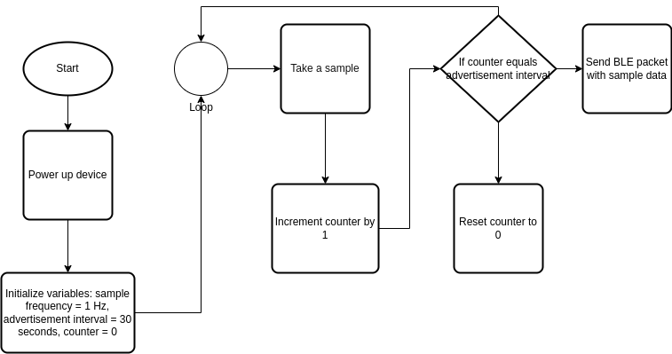

Project Name: Environmental Sensor Data Simulation
This project simulates mock environmental sensor data using random numbers within a specified range. The project uses the following data sheets and tools:

SHT4x: 4th generation digital relative humidity and temperature sensor with low power consumption, high accuracy and robust design. It uses I2C interface and operates in the range of 0 to 100 %RH and -40 to 125 °C.
PAS CO2: Real carbon dioxide sensor based on photoacoustic spectroscopy (PAS) principle. It has a small form factor, high accuracy, and low power consumption. It uses I2C, UART, and PWM interfaces and operates in the range of 0 to 32000 ppm.
BME680: Gas sensor that integrates high-linearity and high-accuracy gas, pressure, humidity and temperature sensors. It uses I2C and SPI interfaces and operates in the range of 300 to 1100 hPa, 0 to 100 %RH, -40 to 85 °C and can detect various volatile organic compounds (VOC).
Note that this project only simulates mock environmental sensor data using random numbers within a specified range, and does not use any real 12c sensor.

References
[1] SHT4x Datasheet. (n.d.). Retrieved from https://www.mouser.com/datasheet/2/682/Datasheet_SHT4x-1917879.pdf

[2] Infineon. (n.d.). CO2 Sensors. Retrieved from https://www.infineon.com/cms/en/product/sensor/co2-sensors/pasco2v01/

[3] Bosch Sensortec. (n.d.). BME680. Retrieved from https://www.alldatasheet.com/datasheet-pdf/pdf/1132061/BOSCH/BME680.html

Installation and Usage
Clone the project repository from GitHub.

Navigate to the root directory of the project.

Open the terminal and type ./output to run the program.

Tools Used
The following AI tools and models were used in the completion of this project:

GitHub
Codewisher
ChatGPT
Bing AI
GPT-4

Algorithm

Running the Program
To run the program, use the following command in the terminal:

bash
Copy code
/.output

The above flowchart outlines the algorithm used in this project.

Credits
This project was completed as a candidate assignment for the Embedded Systems Developer Intern & New Graduate position at Borda Academy 2023.